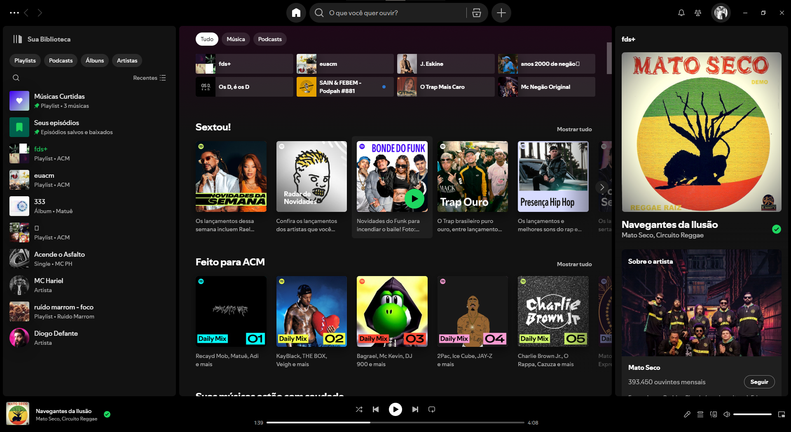
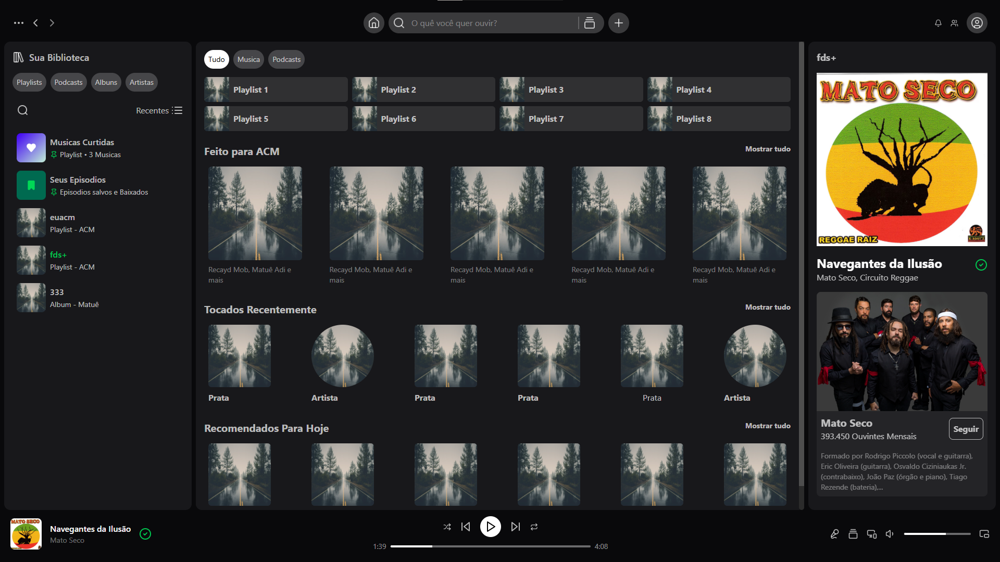

# Recriação do Layout do Spotify

Este é um projeto de estudo onde recriei o layout do Spotify utilizando **Vite**, **React**, **TailwindCSS** e **Lucide Icons**. O objetivo foi melhorar minhas habilidades com essas ferramentas e aprender mais sobre o processo de construção de interfaces modernas.

## Tecnologias Utilizadas

- **Vite**: Ferramenta para construir e rodar projetos React de forma rápida e otimizada.
- **React**: Biblioteca JavaScript para criar interfaces de usuário.
- **TailwindCSS**: Framework CSS utilitário para facilitar o desenvolvimento de layouts responsivos e customizados.
- **Lucide Icons**: Conjunto de ícones para usar em componentes interativos.

## Demonstração

Aqui estão algumas imagens comparando o layout original do Spotify e a versão recriada:

### Layout Original



### Layout Recriado



## Como Rodar o Projeto

1. Clone o repositório:
    ```bash
    git clone https://github.com/arthuracmm/spotify-tailwind
    ```

2. Navegue até o diretório do projeto:
    ```bash
    cd spotify-tailwind
    ```

3. Instale as dependências:
    ```bash
    npm install
    ```

4. Rode o servidor de desenvolvimento:
    ```bash
    npm run dev
    ```

5. Acesse o projeto no seu navegador em [http://localhost:3000](http://localhost:3000).

## Conclusão

Esse projeto foi uma ótima oportunidade para aprofundar meu conhecimento sobre as tecnologias mencionadas e praticar a criação de interfaces responsivas e funcionais.
